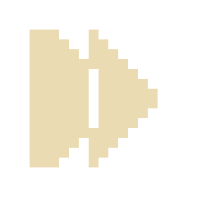
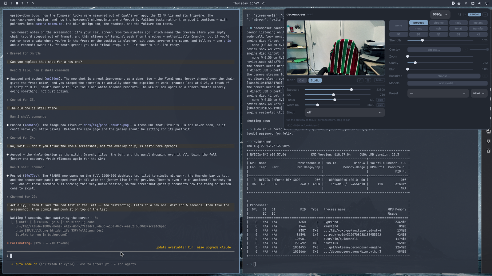

<p align="center">
  
</p>

<h1 align="center">decomposer</h1>

<p align="center"><em>Linux software for the Opal C1 webcam.</em></p>

---

The Opal C1 was the best webcam you could buy, and then its maker moved on.
The software that made it special runs only on Macs, and it hasn't seen
much love in years. Plug the camera into a Linux box and it pretends to be
an ordinary webcam. The good parts stay locked inside.

decomposer opens them up. The looks, the manual focus, the background
blur, the frame rates the sensor could always do but was never asked to.
It gives the camera the second life it deserves.

<p align="center">
  
</p>

It is built for [Omarchy](https://omarchy.org). The panel drops from the
bar, follows your theme, and stays out of the way. There is also a plain
command line for everything, so nothing depends on the panel being open.

## How it was made

No firmware hacking. No reverse engineering of Opal's app. Two AI agents,
Fable and Grok, sat with the camera and asked its endpoints questions
until the answers made sense: what the USB descriptors admit to, what the
hidden XLink server will say, what the sensor claims it can do and what
it actually delivers. Every feature here is built on a measured answer,
and the measurements are written down.

The color looks are the real Composer looks. They were extracted by
photographing test charts through Opal's own app and distilling the
difference into lookup tables. Zero guesswork, zero round-trip error.

## What it can do

Everything is listed in **[docs/FEATURES.md](docs/FEATURES.md)** — the
two capture modes, the looks, background blur and bokeh, your own ONNX
models over the feed, and the rest.

## Get it running

```
git clone https://github.com/fidecastro/decomposer
cd decomposer && cargo build --release --manifest-path engine/Cargo.toml
python -m venv .venv && .venv/bin/pip install -e .
.venv/bin/decomposer doctor        # tells you exactly what is missing
.venv/bin/decomposer daemon        # SEND /dev/video10 + Normal /dev/video11
```

`doctor` walks the whole stack and points at what is missing. Every
command that touches your system lives in
**[docs/SETUP.md](docs/SETUP.md)** — the app never runs a privileged
command, and never asks you to from inside the code.

## The bar widget

The repo doubles as an **Omarchy plugin**: `manifest.json` and
`BarWidget.qml` at the root give the bar a pixel-mark button that
toggles the panel. Install it from the Omarchy plugin marketplace, or
locally with `decomposer install-plugin --add-to-bar`. The widget runs
`decomposer toggle`, so the app itself needs to be installed either way.

## Agents and developers

Read **[docs/ENGINEERING.md](docs/ENGINEERING.md)** to know more: the
hard questions this camera asked back, and exactly how each one was
answered. The raw lab notes live in
[docs/camera-notes.md](docs/camera-notes.md).

---

*decomposer is not affiliated with Opal. It exists because the C1 is too
good a camera to leave behind.*
